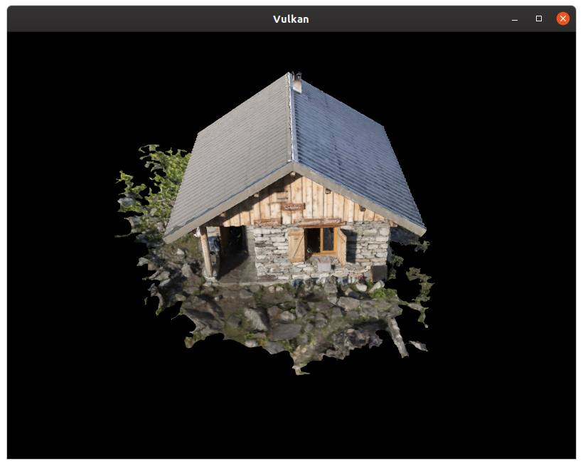

vulkan tutorial
===============

based on https://vulkan-tutorial.com/



what follows is has only been tested/run on Ubuntu Linux

pre-reqs
--------

1.	[Vulkan SDK](https://vulkan.lunarg.com/sdk/home) (headers, libraries, and utilities)
	-	For nvidia hardware, also installed Vulkan 1.2 Driver (developer beta right now) from https://developer.nvidia.com/vulkan-driver
2.	`glfw3` lib and headers installed (for multi-platform desktop development)
3.	`GLM` headers installed (header-only mathematics library)
4.	CMake build tool installed
5.  And to run example, download model(s).  See [models](models/README.md) README.

In `3rdparty` directory are copies of [tinyobjloader](https://github.com/tinyobjloader/tinyobjloader) and [stb_image](https://github.com/nothings/stb) header only libraries.

On Ubuntu, for things other than Vulkan SDK (tested to work on 19.10 and 20.04):


```
sudo apt install cmake
sudo apt install libglfw3-dev
sudo apt install libglm-dev
```

#### Install the SDK on Ubuntu

from [LunarG SDK Download](https://vulkan.lunarg.com/sdk/home) area, and
[Ubuntu](https://vulkan.lunarg.com/doc/view/1.2.131.2/linux/getting_started_ubuntu.html#user-content-install-the-sdk) instructions

##### Instructions for Ubuntu 18.04 (Bionic Beaver)

Also worked on Ubuntu 19.10 and 20.04

```
wget -qO - http://packages.lunarg.com/lunarg-signing-key-pub.asc | sudo apt-key add -
sudo wget -qO /etc/apt/sources.list.d/lunarg-vulkan-bionic.list http://packages.lunarg.com/vulkan/lunarg-vulkan-bionic.list
sudo apt update
sudo apt install vulkan-sdk
```


Build using cmake
-------------

Inspect `CMakeLists.txt` for what will be built. All the examples in succession were commited along the way.


DEBUG


For validation layers to be enabled, need the `Debug` build

```
# generate
cmake \
    -D CMAKE_EXPORT_COMPILE_COMMANDS=ON -D CMAKE_BUILD_TYPE=Debug \
    -B build/debug .

# build
VERBOSE=1 cmake --build build/debug --target vulTut --parallel 7 --clean-first

# run
build/debug/vulTut

```


RELEASE

```shell
# generate
cmake \
    -D CMAKE_BUILD_TYPE=Release \
    -B build/release .

# build
cmake --build build/release --target vulTut --parallel 7

# run
build/release/vulTut
```


## Other considerations

On a Haswell system using the Intel integrated graphics (Intel(R) HD Graphics 4600 (HSW GT2), Driver Version: `20.0.0`), there's a warning, but example seems to run fine

    INTEL-MESA: warning: Haswell Vulkan support is incomplete

See utilities  `vulkaninfo`, `vkcube`, `vkcubepp`, `vkvia`, etc.
